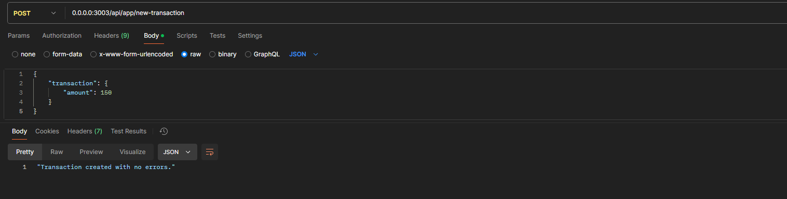
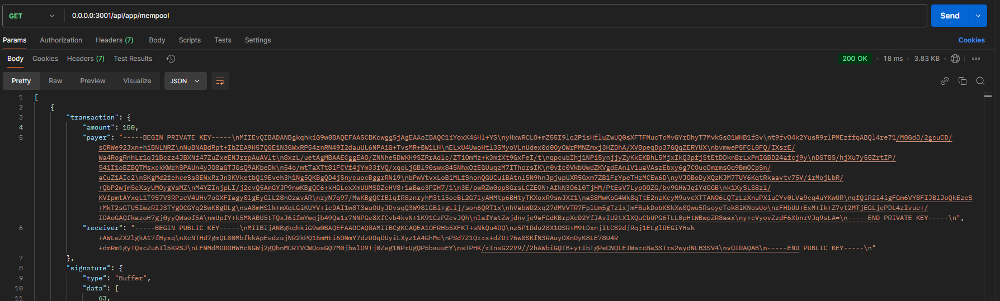

# Blockchain Implementation in Node.js

## Table of Contents

1. [Project Overview](#project-overview)
2. [Tech Stack](#tech-stack)
3. [Features](#features)
4. [Demonstration](#demonstration)
5. [Getting Started](#getting-started)
6. [Development Setup](#development-setup)
7. [API Documentation](#api-documentation)
8. [Protocol](#protocol)
10. [Contributing](#contributing)
11. [License](#license)

## Project Overview

This is a simple Blockchain implementation using NodeJs. We simulate a network of nodes using docker, where each node is a container in the network.

## Features
- **Transaction Creation and Broadcasting**: Nodes can create transactions and disseminate them across the network. 
- **Transaction Validation**: Each node validates transactions by verifying their signature and ensuring data integrity before adding them to its mempool.
- **Mining with Proof-of-Work**: Transactions in the mempool are mined using a computationally intensive Proof-of-Work system, ensuring blockchain security.
- **Decentralized P2P Network**: Nodes can discover and connect with each other dynamically using peer-to-peer communication.
- **Chain Synchronization (To Be Implemented)**: Nodes periodically sync their local blockchain with others to ensure consistency and adopt the longest valid chain.

P2P communication: the protocol used to one node comunicate with others and disseminate informations across the network. 

## To do
- Chain sync service: time to time we need to compare the local chain with the one in the network. The chain version accepted is the one used by most nodes.
- Custom wallets: allow users to register new wallets and use them when creating a new transaction.
- Validate the integrity of new transactions.

## Tech Stack
- **Node.js**: Backend logic
- **Docker**: Containerization
- **Libp2p**: Peer-to-peer networking
- **Express.js**: REST API
- **TypeScript**: Type safety

## Demonstration

First, start the network by running the `docker-compose` script.

### Creating Transactions
After starting, select a node and send a request to create a new transaction:

Immediately after creation, the transaction is broadcast to the network. Receiving nodes validate and add it to their local mempool.

### Viewing the Mempool
You can view the transactions in a node's mempool:

### Mining Transactions
Each node mines transactions from its local mempool and adds them to its local chain, if appliable.

## Getting Started

### Prerequisites

- Docker (v20+)
- Docker Compose (v2+)

### Running the Application

1. Clone the repository.

2. Start the network: `` docker compose up ``.

3. Access the nodes: Each node exposes an API on port 3000 + the index number of the node.

### API Endpoints

Each node provides the following endpoints for interacting with the network:

- **`/api/app/mempool`**: Returns the list of transactions in the node's mempool.
- **`/api/app/chain`**: Returns the blockchain state of the node.
- **`/api/app/new-transaction`**: Creates a new transaction and broadcasts it to the network.

## Contribute

Contributions are welcome! The best way to contribute is by opening an issue to discuss your suggestions, questions, or problems. From there, we can work on an appropriate solution together.

Feel free to fork and experiment! Feedback is always appreciated.

